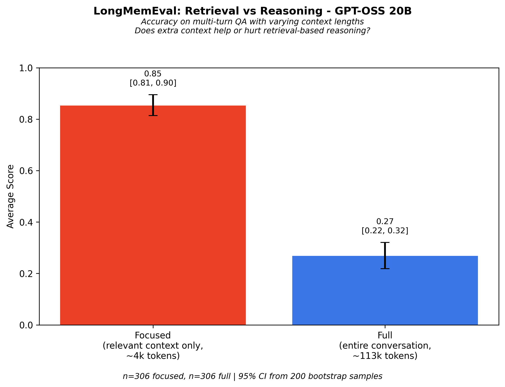
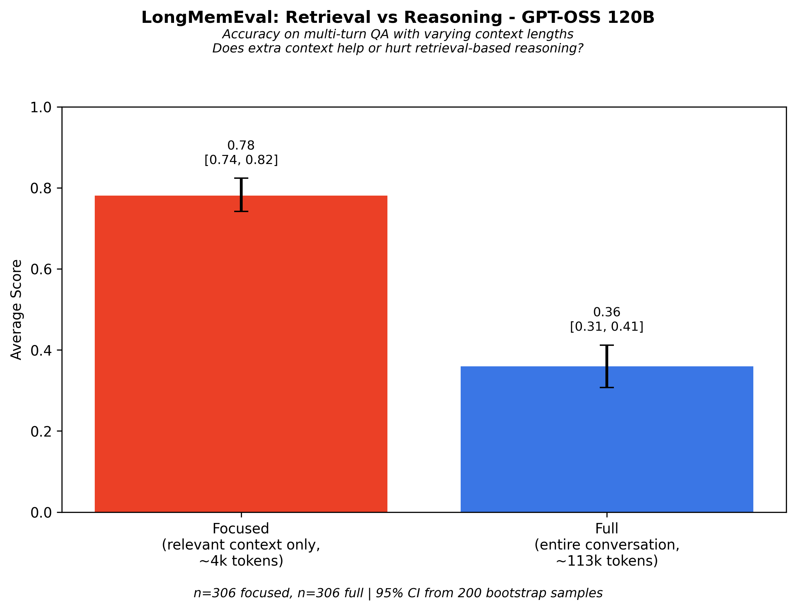

# RY's Context Rot Paper Extension

This repo houses a fork where I extended the Context-Rot paper's findings to newer open-source models:
- OpenAI's GPT-OSS
- NVidia's Nemotron

### Benchmarking GPT-OSS and Nemotron on Long-Context Degradation

Large Language Models advertise 128K+ token context windows, but performance doesn't scale uniformly across that window. **Context rot** describes the phenomenon where model performance degrades as input length increases—even on simple retrieval tasks that should be trivial.

<p align="center">
  
</p>
<p align="center"><em>Repeated Words task: all models degrade as context grows (from original paper)</em></p>

---

## Prior Paper Findings

The [original Chroma research](https://research.trychroma.com/context-rot) (July 2025) established context rot as a universal phenomenon:

- **Models tested** (18 total):
  - Anthropic: Claude Opus 4, Sonnet 4, Sonnet 3.7, Sonnet 3.5, Haiku 3.5
  - OpenAI: o3, GPT-4.1, GPT-4.1 mini/nano, GPT-4o, GPT-4 Turbo
  - Google: Gemini 2.5 Pro/Flash, Gemini 2.0 Flash
  - Alibaba: Qwen3-235B, Qwen3-32B, Qwen3-8B

- **Key results**:
  - All models showed degradation as input length increased
  - Lower needle-question similarity → faster performance decline
  - Coherent haystacks *hurt* performance vs randomized text
  - Claude models abstain when uncertain; GPT models hallucinate confidently
  - Distractors amplify degradation at longer context lengths

- **Experiments**:
  - NIAH Extension: Semantic needle retrieval across depths and lengths
  - LongMemEval: Focused vs full context comparison
  - Repeated Words: Exact sequence replication fidelity

---

## This Fork: Extending to GPT-OSS and Nemotron

We ran the same experiments on **models released after the paper** — specifically the most commonly used small, single-GPU models:

- **GPT-OSS 20B/120B** — OpenAI's Apache 2.0 MoE models (late 2025)
- **Nemotron-3-Nano** — NVIDIA's 1M context model

### NIAH Results — Needle Retrieval

<!-- NIAH heatmaps (uncomment when images are added to images/ folder)
<p align="center">
  
  
</p>
<p align="center"><em>Left: GPT-OSS 20B (8.2% overall). Right: GPT-OSS 120B (28.2% overall).</em></p>
-->

| Model | NIAH Accuracy | Notes |
|-------|---------------|-------|
| GPT-OSS 20B | 8.2% [5.4-11.2] | Severe degradation even at 500 tokens |
| GPT-OSS 120B | 28.2% [23.0-32.7] | 3x better than 20B, still poor |
| Nemotron 3 Nano | 15.3% [11.7-19.0] | Despite 1M context window |

*Prior paper tested 18 models (GPT-4.1, Claude Opus 4, Qwen3-235B, etc.) — all showed degradation as input length increased. Lower needle-question similarity → faster decline. Exact figures embedded in paper charts.*

### LongMemEval Results — Retrieval Cost

<p align="center">
  
  
</p>
<p align="center"><em>Left: GPT-OSS 20B (85% → 27%). Right: GPT-OSS 120B (78% → 36%).</em></p>

| Model | Focused | Full | Drop |
|-------|---------|------|------|
| GPT-OSS 20B | 85% | 27% | **-58pp** |
| GPT-OSS 120B | 78% | 36% | -42pp |
| Nemotron 3 Nano | 86% | 39% | -47pp |

**Comparison to prior paper** (extracted from figures):

| Model | Focused | Full | Drop |
|-------|---------|------|------|
| o3 (high reasoning) | 94% | 81% | -13pp |
| Gemini 2.5 Pro | 91% | 72% | -19pp |
| GPT-4.1 | 87% | 62% | -25pp |
| Qwen3-32B | 71% | 44% | -27pp |
| Claude Sonnet 3.7 | 87% | 45% | -42pp |
| Claude Opus 4 | 92% | 38% | -54pp |

GPT-OSS 20B's **-58pp drop is the largest** of any model tested — worse than even Claude Opus 4's conservative abstention behavior. The 120B model (-42pp) performs comparably to mid-tier models like Claude Sonnet 3.7.

### Summary

| Model | Type | Params (Active) | NIAH | LongMemEval Drop |
|-------|------|-----------------|------|------------------|
| **GPT-OSS 20B** | Open MoE | 21B (3.6B) | 8.2% | -58pp |
| **GPT-OSS 120B** | Open MoE | 117B (5.1B) | 28.2% | -42pp |
| **Nemotron 3 Nano** | Open MoE | 31.6B (3.2B) | 15.3% | -47pp |

*Confidence intervals are 95% bootstrap estimates. n=330 for NIAH, n=306 for LongMemEval.*

### Key Takeaways

1. **Context rot persists** — newer model releases don't fix the problem
2. **Model size helps** (120B > 20B) but doesn't eliminate degradation
3. **MoE architecture doesn't help** — all tested models use MoE
4. **1M context ≠ 1M useful context** — Nemotron's claim doesn't translate to performance
5. **Open models show larger drops** than frontier closed models on LongMemEval

---

## Methods

### Experiments (from Original Paper)

Three experiments measure different aspects of context rot:

| Experiment | What It Tests | Metric |
|------------|---------------|--------|
| **NIAH Extension** | Retrieval of semantic (not lexical) needles | Accuracy heatmap |
| **LongMemEval** | Reasoning with/without irrelevant context | Accuracy delta |
| **Repeated Words** | Exact sequence replication fidelity | Levenshtein score |

We replicated all three experiments on newly released models using the same evaluation protocol. See [`methods/`](methods/) for formal specifications with mathematical notation.

### What This Fork Adds

**New infrastructure built for this research:**

1. **Provider abstraction** — Decorator-based registry (`@register("gptoss", "ollama")`) enables adding new model backends without code changes
2. **Multi-deployment support** — Auto-detects OpenAI API, OpenRouter, or local vLLM/ollama
3. **Smart truncation** — Sentence-boundary aware; preserves question at end of prompt when exceeding context
4. **Checkpoint/resume** — Row-level fault tolerance for multi-hour runs; retries failed rows automatically
5. **Token tracking** — LiteLLM integration with live dashboards
6. **Formal methods docs** — Academic-style specifications in [`methods/`](methods/)

**Evaluation protocol (same as original):**
- LLM judge: GPT-4.1 for binary correctness
- Confidence intervals: 95% bootstrap sampling
- Tokenization: `o200k_base` via tiktoken

See [`CLAUDE.md`](CLAUDE.md) for detailed implementation patterns.

### Reproducibility

All results can be reproduced with:

```bash
./scripts/run_full_research.sh
```

- ~10 hours runtime
- Uses OpenAI API (GPT-OSS models) or OpenRouter fallback
- Test mode: `./scripts/run_full_research.sh -t` (~20 min, <$2)

---

<details>
<summary><strong>Getting Started & Running Experiments</strong></summary>

## Data

Datasets can be downloaded [here](https://drive.google.com/drive/folders/1FuOysriSotnYasJUbZJzn31SWt85_3yf?usp=drive_link).

See [`docs/DATASETS.md`](docs/DATASETS.md) for detailed information about datasets, sizes (~400 MB total), and download links.

## Quick Start

### Option 1: Test Mode (Recommended for First-Time Users)

Validate your setup in 10-20 minutes with reduced samples:

```bash
# 1. Setup
python -m venv venv
source venv/bin/activate  # On Windows: venv\Scripts\activate
pip install -r requirements.txt

# 2. Configure environment
cp .env.example .env
nano .env  # Add your API keys

# 3. Run test workflow
./scripts/run_full_research.sh -t
```

**Test mode runs:**
- NIAH: 12 samples (vs 88 production)
- LongMemEval: 40 samples (vs 612 production)
- Repeated Words: 15 samples (vs ~300 production)
- **Cost: < $2, Time: 10-20 minutes**

Results are prefixed with `test_` to avoid confusion with production runs.

### Option 2: Full Research Workflow

After validating with test mode, run the complete research:

```bash
./scripts/run_full_research.sh
```

**Token Tracking**: All experiments automatically track token usage in real-time. Monitor live dashboards during execution:
```bash
tail -f results/gpt_oss_20b_niah_results_token_dashboard.txt
```

See [`docs/RUN_GUIDE.md`](docs/RUN_GUIDE.md) for detailed instructions and configuration options.

### Option 3: Manual Execution

1. Clone the repository
2. Create and activate a virtual environment:
   ```bash
   python -m venv venv
   source venv/bin/activate  # On Windows: venv\Scripts\activate
   ```
3. Install dependencies: `pip install -r requirements.txt`
4. Set up environment variables:
   - **OpenAI**: `OPENAI_API_KEY`
   - **Anthropic**: `ANTHROPIC_API_KEY`
   - **Google**: `GOOGLE_APPLICATION_CREDENTIALS` and `GOOGLE_MODEL_PATH`
   - **GPT-OSS**: See `.env.example` for configuration options

5. Navigate to specific experiment folder and follow README instructions

## Supported Models

- **OpenAI**: GPT-4, GPT-4 Turbo, GPT-3.5
- **Anthropic**: Claude 3 family
- **Google**: Gemini models via Vertex AI
- **GPT-OSS**: GPT-OSS models (gpt-oss-20b, gpt-oss-120b) via local deployment, OpenRouter, or OpenAI API

See [`CLAUDE.md`](CLAUDE.md) for detailed usage examples with all providers.

</details>

---

## Citation

If you find this work useful, please cite the original research:

```bibtex
@techreport{hong2025context,
  title = {Context Rot: How Increasing Input Tokens Impacts LLM Performance},
  author = {Hong, Kelly and Troynikov, Anton and Huber, Jeff},
  year = {2025},
  month = {July},
  institution = {Chroma},
  url = {https://research.trychroma.com/context-rot},
}
```

This repository is a fork extending the [original Chroma research](https://research.trychroma.com/context-rot) to newly released models.
